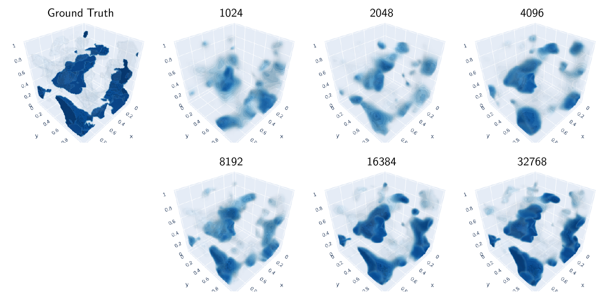

# $\mu$-Net: ConvNeXt-Based U-Nets for Muon Tomography


Muon scattering tomography utilises muons, typically originating from cosmic rays to image the interiors of dense 
objects. However, due to the low flux of cosmic ray muons at sea-level and the highly complex interactions that muons 
display when travelling through matter, existing reconstruction algorithms often suffer from low resolution and high 
noise. In this work, we develop a novel two-stage deep learning algorithm, µ-Net, consisting of an MLP to predict the 
muon trajectory and a ConvNeXt-based U-Net to convert the scattering points into voxels. µ-Net achieves a state-of-the-art 
performance of 17.14 PSNR at the dosage of 1024 muons, outperforming traditional reconstruction algorithms such as the 
point of closest approach algorithm and maximum likelihood and expectation maximisation algorithm. Furthermore, we find 
that our method is robust to various corruptions such as inaccuracies in the muon momentum or a limited detector resolution. 
We also generate and publicly release the first large-scale dataset that maps muon detections to voxels. We hope that 
our research will spark further investigations into the potential of deep learning to revolutionise this field.

Our dataset can be found https://www.kaggle.com/datasets/tomandjerry2005/muons-scattering-dataset. 
The code for data generation can be found at https://github.com/jedlimlx/Muons-Data-Generation.

## Loading Weights

For the tiny model size,
```python
model = Agg3D(
    **{
        'point_size': 1,
        'downward_convs': [1, 2, 3, 4, 5],
        'downward_filters': [8, 16, 32, 64, 128],
        'upward_convs': [4, 3, 2, 1],
        'upward_filters': [64, 32, 16, 8],
        'resolution': 64,
        'threshold': 1e-8
    }
)
```

For the base model size,
```python
model = Agg3D(
    **{
        'point_size': 1,
        'downward_convs': [1, 2, 4, 4, 6],
        'downward_filters': [16, 32, 64, 128, 256],
        'upward_convs': [4, 4, 2, 1],
        'upward_filters': [128, 64, 32, 16],
        'resolution': 64,
        'threshold': 1e-8
    }
)
```

For the large model size,
```python
model = Agg3D(
    **{
        'point_size': 1,
        'downward_convs': [1, 2, 4, 6, 8],
        'downward_filters': [24, 48, 96, 192, 384],
        'upward_convs': [6, 4, 2, 1],
        'upward_filters': [192, 96, 48, 24],
        'resolution': 64,
        'threshold': 1e-8
    }
)
```

## Training

A sample notebook for loading the data and training the model are available in this repo.

## Sample Reconstructions

Some sample reconstructions from our model can be found below.




>3D reconstructions produced by µ-Net-L at various dosages. The improvement in reconstruction quality as the dosage increases can be seen clearly.

<br>
<br>


>2D cross-sections of the 3D reconstructions produced by µ-Net-L at various dosages. The improvement in
reconstruction quality as the dosage increases can be seen clearly. We also see that some cross-sections appear to have worse cross-sections.
This is because the materials being reconstructed have a high radiation length, so the muons do not scatter very much.

<br>
<br>


> This is a 3D plot and a cross-section of one of the imaging targets from the testing set. The ability
of the model to reconstruct the approximate shapes and differentiate materials is shown clearly. However, there is still a significant amount
of blurring. (left) ground truth, (middle) µ-Net, (right) PoCA
